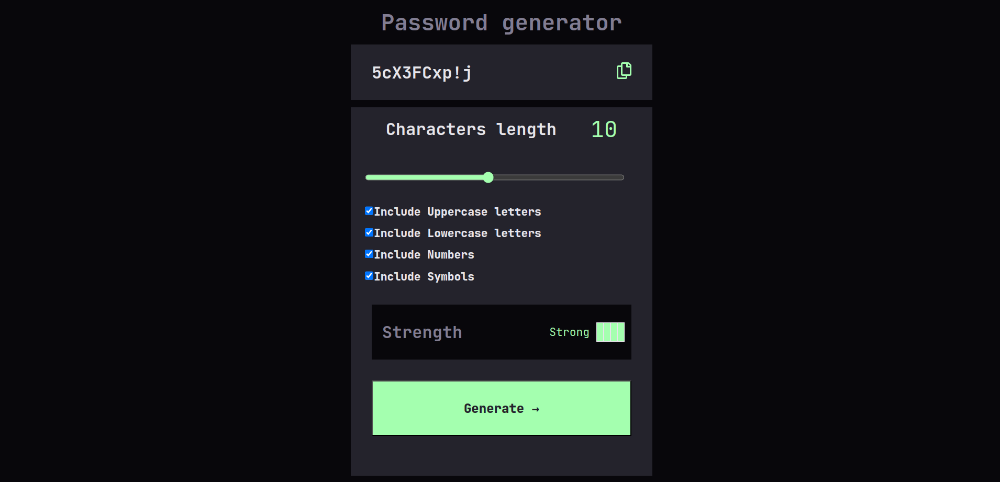

# Password Generator

A web-based **Password Generator** tool that allows users to generate strong, secure passwords based on their preferred character set. This tool evaluates the strength of the generated password and provides an option to automatically copy the password to the clipboard.

## Features

1. **Customizable Character Set**  
   Users can select the character types to include in the generated password, such as:
   - Uppercase letters
   - Lowercase letters
   - Numbers
   - Special characters
2. **Password length determination**  
   User can deremine length of password
3. **Password Strength Evaluation**  
   The tool evaluates the strength of the generated password and provides feedback based on criteria like length, diversity of characters, and more.

4. **Copy to Clipboard**  
   Easily copy the generated password to the clipboard with a single click.

## Technologies Used

- **HTML** for structuring the web page
- **SASS** for styling
- **JavaScript** for handling password generation, evaluation, and clipboard functionality

## Screenshots

## How to Use

1. Select the desired character set for your password.
2. Click the "Generate" button to create a new password.
3. The password strength will be evaluated and displayed.
4. Optionally, click the "Copy to Clipboard" button to use the generated password immediately.

Feel free to explore the code and customize it as per your needs!
